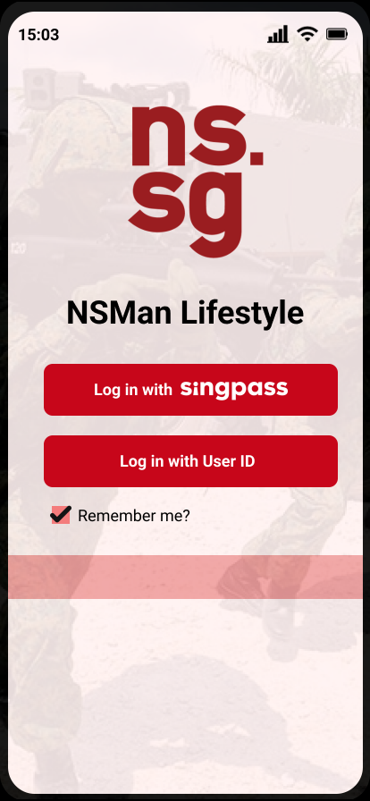
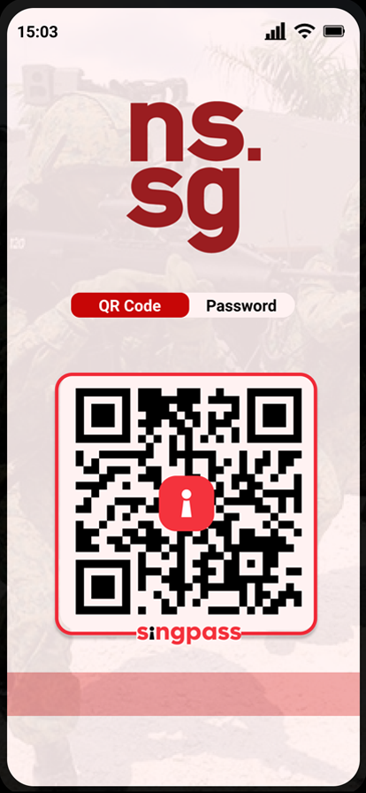
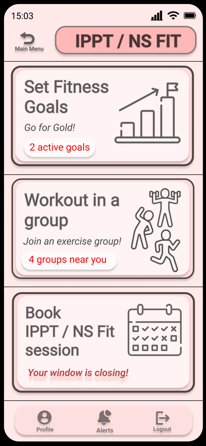

<!-- PROJECT LOGO -->
<br />
<div>
  <div align="center">
    <h1 style="font-weight: bold">DSTA Hackathon</h1>
      
      
      
    <br />
    <br />
    <p align="center">
        How can we leverage digital technologies to enable greater convenience and flexibility for our NSmen in the workspaces in which they live, work, and play.
<br />
<a href="https://github.com/helloitsm3/dsta-hackathon/issues">Report Bugs</a>
·
<a href="https://github.com/helloitsm3/dsta-hackathon/issues">Request Feature</a>
</p>

  </div>
</div>

<!-- TABLE OF CONTENTS -->

## Table of Contents

- [Table of Contents](#table-of-contents)
- [Built-with](#built-with)
- [Getting Started](#getting-started)

<br />

## Built-with

-   [Expo](https://expo.dev/)
-   [React Native](https://reactnative.dev/)
-   [AWS Amplify](https://aws.amazon.com/amplify/)
-   [AWS Lambda](https://aws.amazon.com/lambda/)

<br />

<!-- GETTING STARTED -->

## Getting Started

This is an example of how you can set up your project locally. To get a local copy up and running follow these simple example steps.

1. Clone the repo

```sh
git clone with HTTPS          https://github.com/helloitsm3/dsta-hackathon.git
git clone with SSH            git@github.com:helloitsm3/dsta-hackathon.git
git clone with Github CLI     gh repo clone helloitsm3/dsta-hackathon
```

2. Development

```sh
1. cd app
2. npm install
3. npm run start
```
